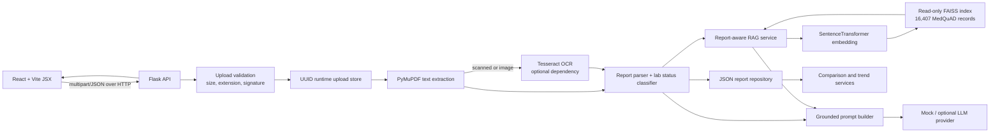

# MedExplain architecture

MedExplain is a local educational report-explanation application. The React JSX client uploads PDF/JPEG/PNG reports to Flask. The backend validates the type, size, and content signature; creates an opaque UUID filename; extracts a PDF text layer or uses Tesseract OCR when available; parses laboratory fields; persists a JSON report record; retrieves general MedQuAD context from the existing read-only FAISS index; and passes separated report facts and retrieved context to an optional LLM provider. The LLM prompt prohibits diagnosis, treatment recommendations, and invented report values. Multi-report comparison and trends are computed only from persisted extracted values.

Runtime report uploads and JSON records are excluded from version control. The vector index and MedQuAD source are read-only application assets; Stage 8 evaluation never rebuilds or changes either.
